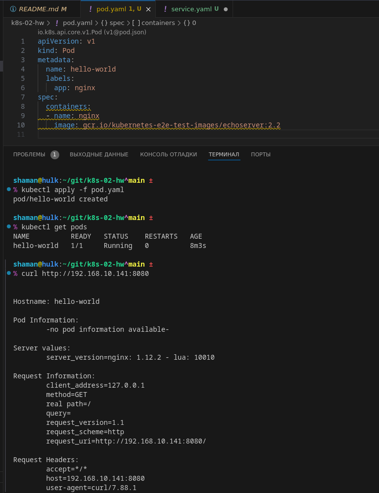

# Домашнее задание к занятию «`Базовые объекты K8S`» - `Живарев Игорь`

# Домашнее задание к занятию «Базовые объекты K8S»

### Цель задания

В тестовой среде для работы с Kubernetes, установленной в предыдущем ДЗ, необходимо развернуть Pod с приложением и подключиться к нему со своего локального компьютера. 

------

### Чеклист готовности к домашнему заданию

1. Установленное k8s-решение (например, MicroK8S).
2. Установленный локальный kubectl.
3. Редактор YAML-файлов с подключенным Git-репозиторием.

------

### Инструменты и дополнительные материалы, которые пригодятся для выполнения задания

1. Описание [Pod](https://kubernetes.io/docs/concepts/workloads/pods/) и примеры манифестов.
2. Описание [Service](https://kubernetes.io/docs/concepts/services-networking/service/).

------

### Задание 1. Создать Pod с именем hello-world

1. Создать манифест (yaml-конфигурацию) Pod.
2. Использовать image - gcr.io/kubernetes-e2e-test-images/echoserver:2.2.
3. Подключиться локально к Pod с помощью `kubectl port-forward` и вывести значение (curl или в браузере).

------

### Задание 2. Создать Service и подключить его к Pod

1. Создать Pod с именем netology-web.
2. Использовать image — gcr.io/kubernetes-e2e-test-images/echoserver:2.2.
3. Создать Service с именем netology-svc и подключить к netology-web.
4. Подключиться локально к Service с помощью `kubectl port-forward` и вывести значение (curl или в браузере).

------

### Правила приёма работы

1. Домашняя работа оформляется в своем Git-репозитории в файле README.md. Выполненное домашнее задание пришлите ссылкой на .md-файл в вашем репозитории.
2. Файл README.md должен содержать скриншоты вывода команд `kubectl get pods`, а также скриншот результата подключения.
3. Репозиторий должен содержать файлы манифестов и ссылки на них в файле README.md.

------

### Критерии оценки
Зачёт — выполнены все задания, ответы даны в развернутой форме, приложены соответствующие скриншоты и файлы проекта, в выполненных заданиях нет противоречий и нарушения логики.

На доработку — задание выполнено частично или не выполнено, в логике выполнения заданий есть противоречия, существенные недостатки.

---


## Ответ


### Задание 1. Создать Pod с именем hello-world

Код `YAML` файла, запуск проверка работоспособности и curl запрос до сервера через проброшенный порт в IDE VSCode


Открытая страница в браузере  


Запуск `port-forward` на сервере с `microk8s`
```
igor@microk8s:~$ microk8s kubectl port-forward -n default pod/hello-world 8080:8080 --address 0.0.0.0
Forwarding from 0.0.0.0:8080 -> 8080
Handling connection for 8080
Handling connection for 8080
Handling connection for 8080
Handling connection for 8080
```


### Задание 2. Создать Service и подключить его к Pod

Коды `YAML` файлов, запуск проверка работоспособности и curl запрос до сервера через проброшенный порт в IDE VSCode


Открытая страница в браузере  


Запуск `port-forward` на сервере с `microk8s`
```
igor@microk8s:~$ microk8s kubectl port-forward -n default service/netology-svc 8080:80 --address 0.0.0.0
Forwarding from 0.0.0.0:8080 -> 8080
Handling connection for 8080
Handling connection for 8080
Handling connection for 8080
```

---
 